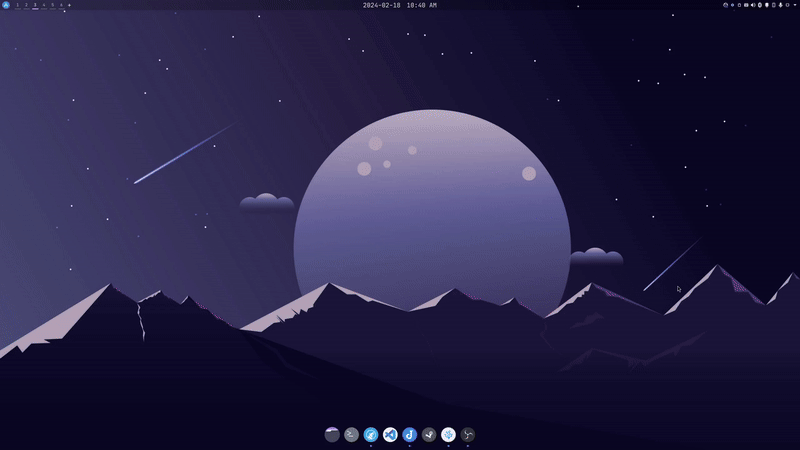

# Arch Desktop Configs
My desktop config using Arch w/ KDE Plasma. Currently main desktop in use but also trying out towards NixOS w/ AwesomeWM (see [here]()).

## Workflow Demo

Before I was not used to tiling hence why I didn't use a tiling manager and mainly used floating mode, but I did setup very basic manual tiling as shown above. I use dual monitor (not shown in demo gif) so most of the secondary windows go there (like chats, documentations, etc).

## System Info
- OS: Arch
- DE: KDE
- Appearance:
    - Global Theme: Dracula
    - Colors: Catppuccin Mocha Mauve
    - Plasma Style: ChromeOS
    - Application Style: Breeze
    - Window Decorations: Scratchy
    - Fonts: Mono Nerd Font Mono 10 pt
    - Icons: Tela Circle Dark
- Topbar + Dock: Latte Dock
    - Widgets Used in Topbar (left to right):
        - Legacy Application Launcher
        - Virtual Desktop Bar
        - Justify Splitter
        - Better inline clock
        - Justify Splitter
        - System Tray

## Configs
The `plasma` and `color-schemes` folder goes into `~/.local/share`. These are where the `Appearance` stuff in the `KDE system settings application` are stored in.

For latte dock can just import. Note that latte dock is no longer developed so it may be deprecated in the future.

The shortcuts I use can be exported using `KDE system settings application` in `shortcuts` section and `import scheme`. 

The widgets are stored in `plasma/plasmoids` in this repo, or `~/.local/share/plasma/plasmoids` in local storage.
